# UML图绘制标准

此文档说明了14种常用UML图的绘制标准

## **1.活动图**

主要用于描述系统、子系统或业务过程中的一系列活动以及这些活动之间的控制流。活动图展示了从活动到活动的流程，包括决策点（如分支和合并）、并行执行的活动以及可能的流程循环。它们对于理解和设计系统的工作流程非常有用，特别是在业务流程建模、工作流建模和系统动态行为建模中。

### **活动图的主要组成部分**

1.活动（Actions）：代表系统或业务过程中的一个操作步骤或任务。活动之间通过控制流连接。

2.控制流（Control Flows）：箭头表示从一个活动到另一个活动的流程。控制流可以是单向的，也可以是带有条件分支的，还可以表示循环或并发。

3.决策点（Decision Points）：包括分支（Fork）和合并（Join）。分支用于表示并行活动的开始，而合并用于表示并行活动的结束。

4.泳道（Swimlanes）：将活动图划分为不同的逻辑区域，每个区域代表不同的参与者（如用户、系统或子系统），有助于理解不同实体在过程中的角色和责任。

5.开始和结束点：分别表示活动图的起点和终点。

6.对象流（Object Flows）：虽然活动图主要关注流程控制，但也可以表示对象或数据的流动，尤其是在对象之间传递数据时。


[活动图](https://www.processon.com/view/55ae67bfe4b0d2cdb520fcff)

### PlantUML基本元素代码

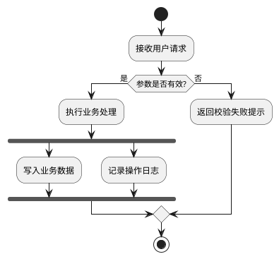

## **2.用例图**

是软件工程中用于展示系统外部用户（参与者）与系统内部功能（用例）之间交互关系的一种图形化工具。它是UML（统一建模语言）中用于需求分析阶段的一种重要图表，旨在帮助开发人员和用户理解系统的功能需求。

### **用例图的基本组成:**

1.参与者（Actor）：

参与者是与系统交互的外部实体，可以是人、组织、外部系统或硬件设备。

在用例图中，参与者通常用“小人”图标表示。

2.用例（Use Case）：

用例代表系统的一个功能单元，描述了系统如何响应参与者发出的请求。

它定义了系统的行为，即系统在特定条件下对特定参与者请求的反应。

在用例图中，用例通常用一个椭圆来表示，并在其中写上用例的名称。

3.关联（Association）：

关联表示参与者与用例之间的关系，即哪个参与者能够触发哪个用例。

关联通常用一条实线表示，一端连接到参与者，另一端连接到用例。

4.包含（Include）：

包含关系表示一个用例（包含用例）的功能被另一个用例（基用例）所包含或使用。

在用例图中，包含关系用带有“<\<include>>”标签的虚线箭头表示，箭头指向基用例。

5.扩展（Extend）：

扩展关系表示在特定条件下，一个用例（扩展用例）可以插入到另一个用例（基用例）中，为其增加额外的行为。

在用例图中，扩展关系用带有“<\<extend>>”标签的虚线箭头和一个圆圈（表示扩展点）表示，箭头指向基用例，圆圈连接到基用例中的一个点。


[人员规划设计UML用例图](https://www.processon.com/view/664246d4ddb7db1efd6f4bf3)

### PlantUML基本元素代码

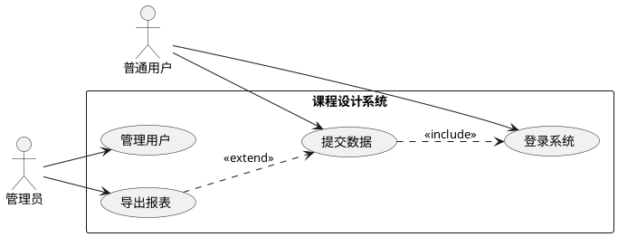

## **3.交互概览图**

主要用于将不同交互图（如顺序图、通信图等）衔接在一起，以提供对交互过程中控制流的整体概览。以下是关于交互概览图的详细解释：

### **定义与特点**

定义：交互概览图是交互图与活动图的混合物，可以将其理解为细化的活动图，其中的活动都通过一些小型的顺序图来表示；也可以将其理解为利用标明控制流的活动图分解过的顺序图。

特点：交互概览图并没有引入新的建模元素，其主要元素来自于活动图和时序图。它侧重从整体上概览交互过程中的控制流，包括交互图之间的事件或消息流。


[交互概览图](https://www.processon.com/view/558004afe4b01d99c645a33f)

### PlantUML基本元素代码

PlantUML没有独立的交互概览图专用语法；绘制时可用活动图表达总体控制流，并用 `note` 或动作节点引用对应的时序图源文件。

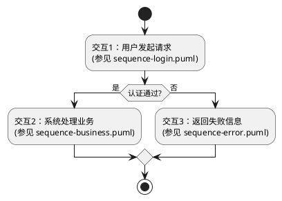

## **4.时序图**

是一种UML（统一建模语言）交互图。它通过描述对象之间发送消息的时间顺序来显示多个对象之间的动态协作。以下是关于时序图的详细解释：

### **定义与特点**

定义：时序图用于展示对象之间的交互顺序，它按照时间顺序排列对象之间的消息传递，从而清晰地表达对象之间的协作关系。

特点：时序图具有时间顺序性，能够直观地展示对象之间交互的先后顺序和时序关系。同时，它还能够表示并发进程，通过不同的生命线来区分不同对象的执行过程。

### **时序图主要由以下几个元素组成：**

对象（Object）：代表时序图中的实体，可以是系统角色、子系统或其他对象。对象在时序图中通过生命线来表示其存在时间。

生命线（Lifeline）：时序图中每个对象底部中心的垂直虚线，表示对象在一段时间内的存在。生命线上的窄矩形代表对象的活动期，即对象执行某项操作的时期。

消息（Message）：对象之间传递的信息，用于表示对象之间的交互。消息可以带有参数和条件表达式，以表示传递的数据和交互的条件。

控制焦点（Activation）：对象执行操作时的时期，在时序图中用生命线上的窄矩形来表示。控制焦点表示对象在某一时间点开始执行某项操作，并持续一段时间。


[UML时序图-用户登录验证](https://www.processon.com/view/667eb078891c512f2ed6c79e)

### PlantUML基本元素代码

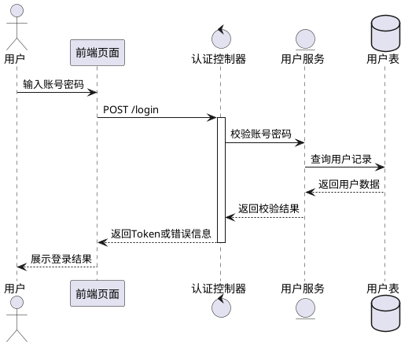

## **5.状态图**

是UML（统一建模语言）中的一种重要图表，用于描述一个实体（如对象、组件、子系统等）基于事件反应的动态行为。它展示了该实体如何根据当前所处的状态对不同的事件做出反应，以及这些事件如何导致状态之间的转换。UML状态图在软件开发过程中被广泛应用于分析、设计和实现阶段，以帮助开发者理解和设计系统的动态行为。

### PlantUML基本元素代码

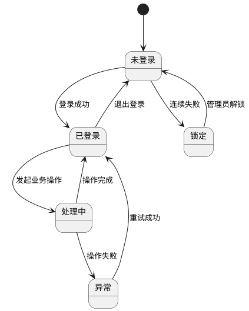

## **6.序列图**

也称为顺序图或时序图，是一种UML（统一建模语言）交互图，主要用于描述系统中对象之间的动态协作和消息传递的时间顺序。以下是序列图的详细简介：

### **定义与特点**

定义：序列图是一种按照时间顺序描述对象之间交互行为的图表。它展示了对象之间发送消息的顺序，以及这些消息如何影响对象的状态。

特点：

时间顺序性：序列图强调对象之间交互的时间顺序，通过横向的时间轴和纵向的对象生命线来展示。

动态协作：它展示了对象之间如何通过消息传递进行协作，从而完成特定的任务或功能。

可视化表示：序列图以图形化的方式展示了对象之间的交互过程，使得系统行为更加直观易懂。


[基础UML序列图](https://www.processon.com/view/6247c523e401fd070dd20b09)

### PlantUML基本元素代码

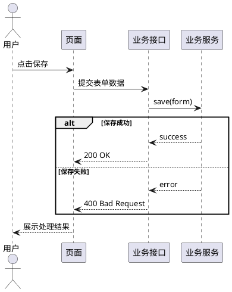

## **7.通信UML图**

在UML 1中称为协作图（Collaboration Diagram），是UML（统一建模语言）中的一种交互图，用于描述一组对象在协作过程中如何互相通信。以下是对通信UML图的详细解释：

### **定义与特点**

定义：通信图展现了多个对象在协同工作达成共同目标的过程中互相通信的情况，通过对象和对象之间的链、发送的消息来显示参与交互的对象。

特点：

强调对象在交互中承担的角色和它们之间的关系。

侧重于展示对象之间的空间组织结构，而非时间顺序。

通过链和消息来连接和传递对象之间的交互信息。


[通信图](https://www.processon.com/view/557104d0e4b0d6a77d65a888)

### PlantUML基本元素代码

PlantUML没有独立的通信图专用语法；绘制时可用对象图语法突出对象链接，并用编号消息标注对象之间的通信顺序。

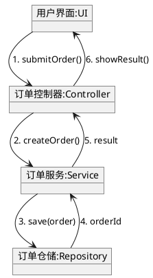

## **8.类图**

它主要用于描述系统中类的集合、类的内部结构（如属性和方法）以及类之间的关系。类图是面向对象建模的主要组成部分，广泛应用于软件工程中的系统分析和设计阶段。以下是关于类图的详细解释：

### **定义与特点**

定义：类图是一种用于表示系统中类的静态结构，包括类、接口以及它们之间关系的图。

特点：

强调类的静态结构，不展示暂时的信息。

描述类的属性（字段）、方法（操作）以及类与类之间的关系（如关联、聚合、组合、继承等）。

是系统编码和测试的重要模型依据。


[仓库管理系统UML类图](https://www.processon.com/view/64dd836f38ec330bdc1c622f)

### PlantUML基本元素代码

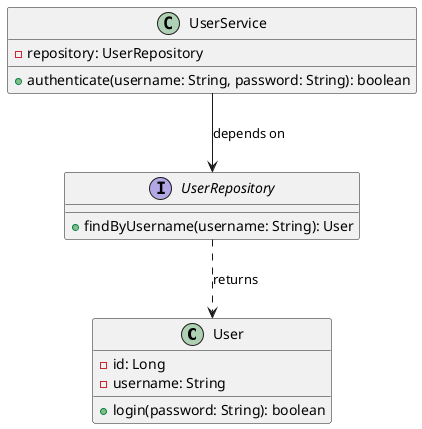

## **9.对象图**

主要用于描述系统在某个特定时刻的具体情况，特别是对象及它们之间的相互关系。以下是对对象图的详细解释：

### **定义与特点**

定义：对象图显示了在某时刻对象和对象之间的关系，反映了系统的静态过程。它是类图的实例，展示了类的多个对象实例以及这些实例之间的关联、组合等关系。

特点：

强调系统在某一时刻的状态，而不是过程或行为。

使用与类图相同的符号和关系，但展示的是类的具体实例。

由于对象存在生命周期，对象图只能在系统某一时间段存在。


[数据库UML对象图](https://www.processon.com/view/665e8678c0f1986312d9fc86)

### PlantUML基本元素代码

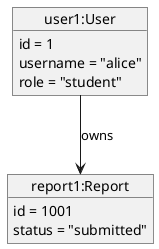

## **10.组件图**

组件图是 UML（统一建模语言）中的一种结构图，用于可视化系统组件的组织和关系。这些图有助于将复杂的系统分解成易于管理的组件，展示它们之间的相互依存关系，确保高效的系统设计和架构。

plantUML官方例示
```
@startuml

package "Some Group" {
  HTTP - [First Component]
  [Another Component]
}

node "Other Groups" {
  FTP - [Second Component]
  [First Component] --> FTP
}

cloud {
  [Example 1]
}


database "MySql" {
  folder "This is my folder" {
    [Folder 3]
  }
  frame "Foo" {
    [Frame 4]
  }
}


[Another Component] --> [Example 1]
[Example 1] --> [Folder 3]
[Folder 3] --> [Frame 4]

@enduml

```

带颜色例子
```
@startuml

skinparam component {
    backgroundColor<<static_lib>> DarkKhaki
    backgroundColor<<shared_lib>> Green
}

skinparam node {
borderColor Green
backgroundColor Yellow
backgroundColor<<shared_node>> Magenta
}
skinparam databaseBackgroundColor Aqua

[AA] <<static_lib>>
[BB] <<shared_lib>>
[CC] <<static_lib>>

node node1
node node2 <<shared node>>
database Production

@enduml
```


[组件图](https://www.processon.com/view/558cae59e4b09bd4b8d8c682)

### PlantUML基本元素代码

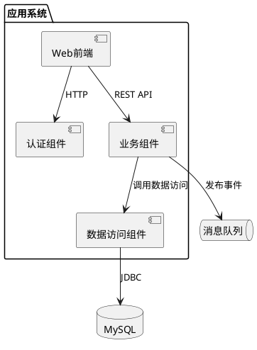

## **11.组合结构图**

用于描述系统中某一部分（即“组合结构”）的内部结构，以及该部分与系统其它部分的交互点。以下是关于组合结构图的详细解释：

### **定义与特点**

定义：组合结构图是一种UML结构图，它表示某一对象的内部结构，其内部由一组小对象组成。它专注于对象内部的组成对象及其相互关系。

特点：

锁定的范围是对象内部，而不是整个系统或业务系统的系统内部。

强调对象内部的组成对象及其协作关系，这与一般业务系统中对象的平等性有所不同。

是一种静态图，展示的是系统在某一方面的静态结构。

### PlantUML基本元素代码

PlantUML没有独立的组合结构图专用语法；绘制时可用组件图的内部部件、接口和端口表达组合对象内部结构。

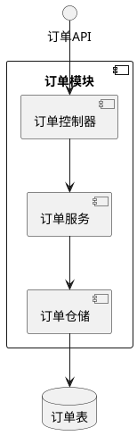

## **12.部署图**

也称为实施图或配置图，是UML（统一建模语言）中的一种静态图，用于显示系统中软件和硬件的物理架构。它描述了系统中硬件的物理拓扑结构以及在此结构上执行的软件。通过部署图，可以了解到软件和硬件组件之间的物理关系以及处理节点的组件分布情况。以下是关于部署图的详细解释：

**定义与特点**

定义：部署图是用来显示系统中软件和硬件的物理架构的图形表示。

特点：

强调硬件和软件组件的物理分布和连接。

显示运行时系统的结构，传达构成应用程序的硬件和软件元素的配置和部署方式。

常用于帮助理解分布式系统。


[UML部署图](https://www.processon.com/view/55883ebae4b01d99c67189ca)

### PlantUML基本元素代码

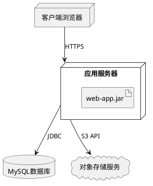

## **13.包图**

主要用于描述系统中包（Package）以及包内所含元素的组织结构和它们之间的依赖关系。以下是对包图的详细解释：

### **定义与特点**

定义：包图是在UML中用类似于文件夹的符号表示的模型元素的组合，用于描述模型中的包和所包含元素的组织方式。

特点：

强调包的组织结构和层次关系。

展示包之间的依赖关系。

可以包含各种类型的UML元素，如类、接口、用例等。


[UML包图](https://www.processon.com/view/557a4dbce4b0b9f0bdb87712)

### PlantUML基本元素代码

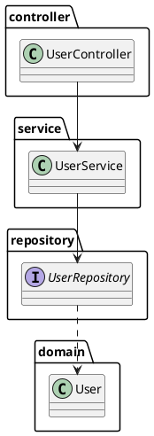

## **14.剖面图**

又称为剖切图，是通过对有关的图形按照一定剖切方向所展示的内部构造图例。剖面图一般用于工程的施工图和机械零部件的设计中，补充和完善设计文件，是工程施工图和机械零部件设计中的详细设计，用于指导工程施工作业和机械加工。除此之外，剖面图也用于生物研究、气象分析等领域。以下是对剖面图的详细解释：

### **定义与特点**

定义：剖面图是假想用一个剖切平面将物体剖开，移去介于观察者和剖切平面之间的部分，对于剩余的部分向投影面所做的正投影图。

特点：

能够直观地展示物体内部的结构和构造形式。

清楚地表达设计思想和意图，便于施工人员理解和执行。

在绘制时，剖切平面的位置和剖切方向需要根据具体情况进行选择，以确保能够充分展示物体的内部特征。

### PlantUML基本元素代码

UML语境中的“Profile Diagram”通常用于展示 stereotype、tagged value 和约束；若本节按工程剖切图理解，PlantUML不提供专用剖切图语法。课程设计报告需要表达软件建模时，可用类图 stereotype 近似表示 UML Profile 的扩展元素。

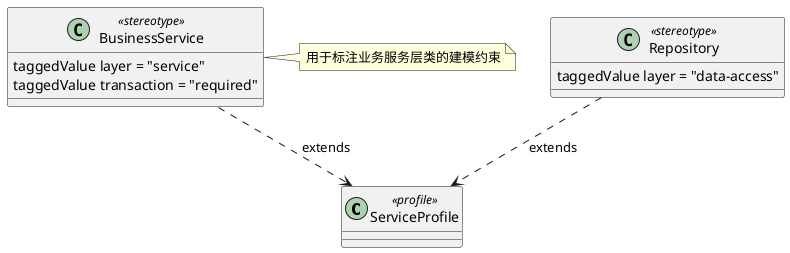
